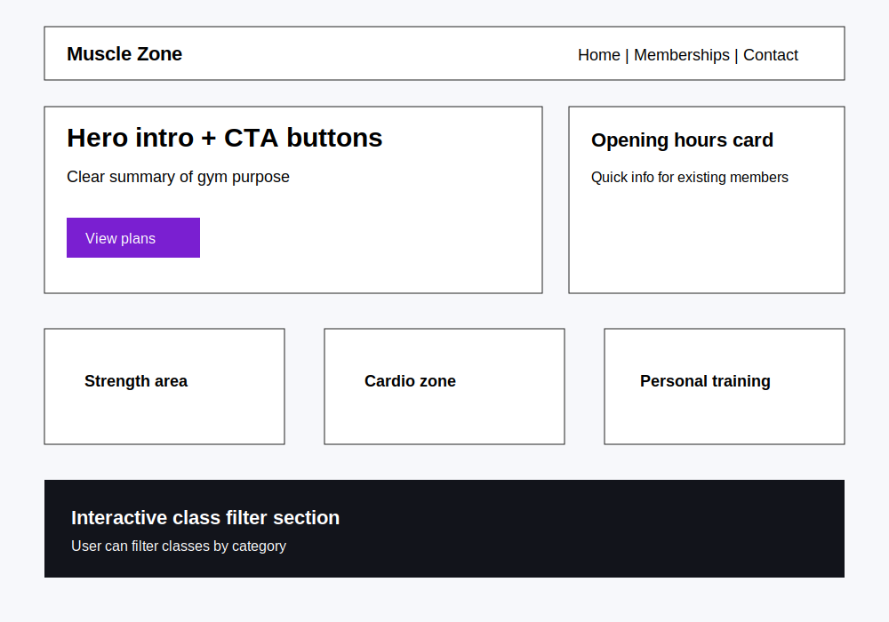
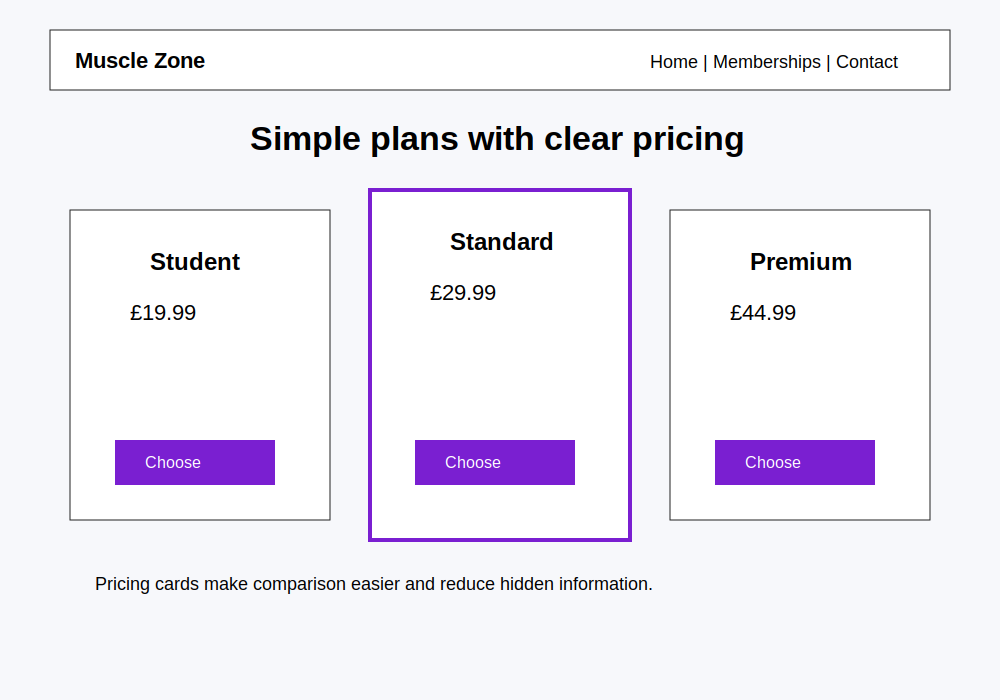
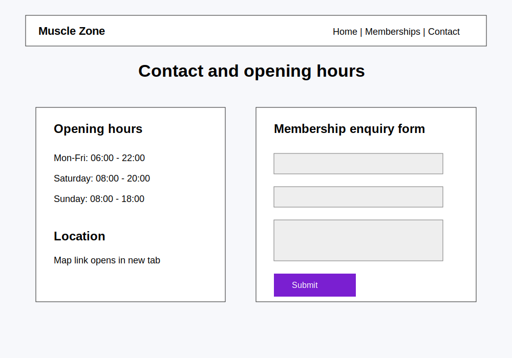
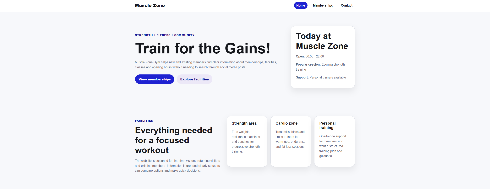
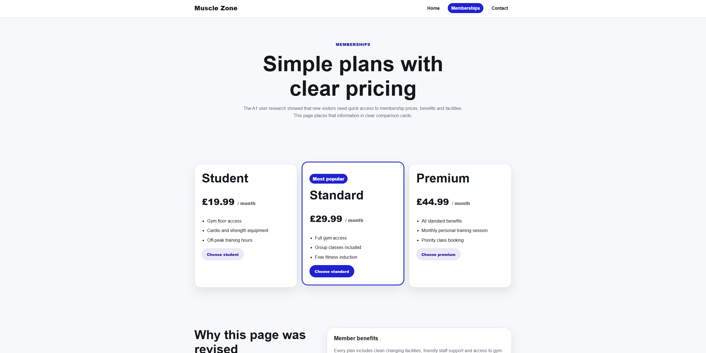
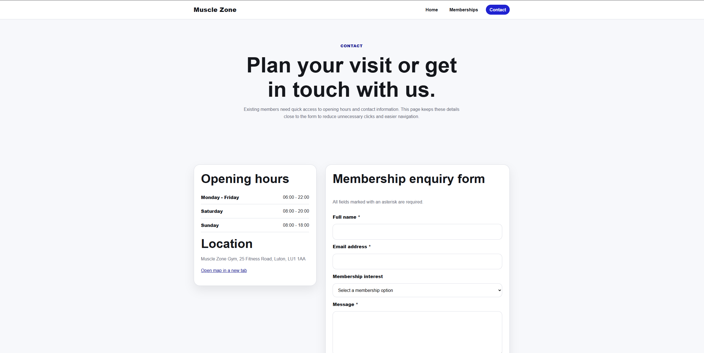

# Muscle Zone Gym - Assignment 2 Front-End UI

## Project overview

This project is a responsive front-end prototype for **Muscle Zone Gym**. It has been developed from the Assignment 1 UX design work, where the main aim was to create a user-centred website for a gym that currently relies too much on social media and word-of-mouth communication.

The purpose of this Assignment 2 project is to turn the original wireframe idea into a working HTML, CSS and JavaScript prototype. The website gives users clear access to membership prices, facilities, classes, opening hours and contact information.

## Live website

GitHub Pages link: **Add your deployed website link here**

## Repository link

GitHub repository link: **Add your GitHub repository link here**

---

# Design

## Aims and objectives

The aim of the website is to improve the online presence and usability of Muscle Zone Gym by giving users a clear and organised place to find important information.

The objectives are:

- To create a responsive website that works on desktop, tablet and mobile screens.
- To show membership plans and pricing clearly.
- To provide information about gym facilities, classes and personal training.
- To make opening hours and contact details quick to find.
- To include accessibility features such as clear headings, keyboard focus states, strong colour contrast and labelled form fields.
- To provide interactive elements that users can control themselves.

## Target users

The website is designed for three main user types from Assignment 1:

1. **First-time visitors** who want to compare membership prices and facilities before joining.
2. **Returning visitors** who want to explore classes, personal training and membership options.
3. **Existing or frequent members** who want quick access to opening hours, contact details and updates.

## User stories from Assignment 1

### User story 1: First-time visitor

As a first-time visitor, I want to see the prices for memberships and gym facilities so that I can decide whether Muscle Zone would be the right gym for me.

### User story 2: Returning visitor

As a returning visitor, I want to explore fitness classes and personal training services so that I can find the correct membership for my fitness goals.

### User story 3: Existing or frequent member

As a frequent visitor, I want to find opening hours and contact information quickly so that I can plan my gym visits efficiently.

## Revised wireframes and design changes

The original Assignment 1 design included three main pages: Homepage, Membership Page and Contact Page. For Assignment 2, the wireframe idea was revised to make the website easier to use and more suitable for a responsive front-end prototype.

### Revised homepage



**Changes made:**

- The homepage now includes a clearer hero section with a short introduction and two call-to-action buttons.
- A quick opening-hours card was added so existing members can see useful information immediately.
- Facility information was organised into separate cards to reduce clutter.
- A class filter section was added as an interactive feature.

**Justification:**

This supports first-time visitors by giving them a quick overview of the gym. It also supports returning visitors by making classes and services easier to browse. The card-based structure improves readability and reduces cognitive load.

### Revised membership page



**Changes made:**

- Membership plans are displayed in three separate pricing cards.
- The most popular plan is visually highlighted.
- Buttons allow users to open a controlled pop-up before moving to the enquiry form.
- Pricing is placed directly on the membership page instead of being hidden further down the website.

**Justification:**

The Assignment 1 competitor analysis identified that hidden pricing can frustrate users. This revision helps first-time visitors compare plans quickly and supports the user story about membership prices being easy to find.

### Revised contact page



**Changes made:**

- Opening hours and location information are placed beside the enquiry form.
- The form includes clear labels and required-field validation.
- The map link opens in a new tab.
- The page focuses on quick access to information for existing members.

**Justification:**

This supports frequent visitors who want to find opening hours and contact details quickly. It also supports accessibility because labels, headings and keyboard focus styles help users understand and navigate the form.

---

# Development

## Technologies used

- **HTML5** for page structure and semantic content.
- **CSS3** for layout, styling and responsive design.
- **CSS Grid** for card layouts and page sections.
- **Media queries** for mobile and tablet responsiveness.
- **JavaScript** for the mobile menu, class filtering, modal pop-up and form feedback.
- **Git and GitHub** for version control.
- **GitHub Pages** for deployment.

## Website structure

```text
muscle-zone-assignment-2/
├── index.html
├── membership.html
├── contact.html
├── css/
│   └── style.css
├── js/
│   └── script.js
├── images/
│   └── add-your-screenshots-here
└── README.md
```

## Pages included

### Home page

The home page introduces Muscle Zone Gym and includes a hero area, facilities section, class highlights and a call-to-action link to the membership page.

### Membership page

The membership page includes three plans: Student, Standard and Premium. It allows users to compare prices and open a pop-up with more information before continuing to the enquiry form.

### Contact page

The contact page includes opening hours, location details, an external map link and a membership enquiry form.

## Accessibility features

Accessibility was considered throughout the development process. The website includes:

- Semantic HTML elements such as `header`, `nav`, `main`, `section`, `article` and `footer`.
- A skip link for keyboard users.
- Strong keyboard focus styles.
- Clear colour contrast between foreground and background colours.
- Form labels connected to each input.
- `aria-label`, `aria-current`, `aria-expanded`, `aria-live` and modal dialog attributes.
- Buttons for interactive features so users control pop-ups and filters themselves.
- Responsive layouts that work on smaller screens.

## Interactive features

The website includes the following interactive features:

1. **Mobile navigation menu** - users can open and close the menu on smaller screens.
2. **Class filter buttons** - users can filter classes by category.
3. **Membership pop-up modal** - users can open and close membership information themselves.
4. **Form validation feedback** - users receive feedback when submitting the enquiry form.

## External code attribution

Most of the code in this project is custom written for this assignment.

External references used during development:

- W3C Web Content Accessibility Guidelines (WCAG): https://www.w3.org/WAI/standards-guidelines/wcag/
- W3C HTML Validator: https://validator.w3.org/
- W3C CSS Validator: https://jigsaw.w3.org/css-validator/
- GitHub Pages documentation: https://pages.github.com/

No Bootstrap or external framework has been used in this version.

## Screenshots of final product

Add screenshots here after you run the website:

### Home page screenshot



### Membership page screenshot



### Contact page screenshot



## Development reflection

During development, I focused on turning the Assignment 1 wireframes into a working front-end prototype. I chose to use custom HTML, CSS and JavaScript because this allowed me to show my understanding of front-end structure, styling and interaction without relying on a framework.

One important design decision was to separate the website into three pages: Home, Memberships and Contact. This followed the Assignment 1 wireframe structure and made the website easier to navigate. It also helped meet the needs of the different user personas. For example, first-time visitors can quickly go to the membership page, while frequent visitors can use the contact page to check opening hours.

Another key decision was to use card-based layouts. This made content easier to scan and reduced the amount of text displayed in one place. The competitor analysis from Assignment 1 showed that too much information on one page can make gym websites harder to use, so I used spacing, headings and cards to improve readability.

A challenge during development was making the layout work on both desktop and mobile screens. To solve this, I used CSS Grid for wider screens and media queries to change the layout into a single-column structure on smaller screens. I also added a mobile menu so navigation remains usable on phones.

Another challenge was adding interactivity while keeping user control. I added filter buttons for classes and a membership modal, but made sure users can open and close these elements themselves. This supports usability because users are not forced into unexpected pop-ups or automatic media playback.

Overall, the final prototype meets the main assignment requirements by providing a responsive website, clear navigation, a working form, accessibility features, interactive elements, organised code and a README documenting the design, development and testing process.

---

# Testing

## Manual testing

| Test area | Test carried out | Expected result | Actual result | Pass/Fail |
|---|---|---|---|---|
| Navigation | Click Home, Memberships and Contact links | Correct page opens | Add result here | Add pass/fail |
| Mobile menu | Resize browser and click menu button | Navigation opens and closes | Add result here | Add pass/fail |
| Membership modal | Click membership plan button | Pop-up opens with selected plan | Add result here | Add pass/fail |
| Modal close | Click close button or press Escape | Pop-up closes | Add result here | Add pass/fail |
| Class filter | Click All, Strength, Cardio and Wellbeing | Correct class cards are displayed | Add result here | Add pass/fail |
| Contact form empty | Submit empty form | Error message appears | Add result here | Add pass/fail |
| Contact form valid | Complete form and submit | Success message appears | Add result here | Add pass/fail |
| External links | Click external links | Links open in a new tab | Add result here | Add pass/fail |
| Responsive design | Test on desktop, tablet and mobile widths | Layout adapts without broken content | Add result here | Add pass/fail |
| Keyboard navigation | Use Tab key through the website | Focus indicator appears and content is reachable | Add result here | Add pass/fail |

## User story testing

### User story 1

**User story:** As a first-time visitor, I want to see the prices for memberships and gym facilities so that I can decide whether Muscle Zone would be the right gym for me.

**Manual test:** I opened the homepage, used the navigation to open the Memberships page, and checked whether all membership plans, prices and benefits were visible.

**Result:** Add your result here.

### User story 2

**User story:** As a returning visitor, I want to explore fitness classes and personal training services so that I can find the correct membership for my fitness goals.

**Manual test:** I opened the homepage and tested the class filter buttons to check whether users can view different types of classes.

**Result:** Add your result here.

### User story 3

**User story:** As a frequent visitor, I want to find opening hours and contact information quickly so that I can plan my gym visits efficiently.

**Manual test:** I opened the Contact page and checked that opening hours, location and the enquiry form were clearly visible.

**Result:** Add your result here.

## Bugs found and fixed

| Bug | How it was found | Fix applied | Status |
|---|---|---|---|
| Mobile menu did not show on small screens | Browser resize testing | Added media query and JavaScript class toggle | Fixed |
| Modal needed a clear close option | Manual modal testing | Added close button, background click and Escape key support | Fixed |
| Contact form needed feedback | Form testing | Added JavaScript validation message | Fixed |

## Unresolved bugs

At the time of writing, no major unresolved bugs have been identified. This section should be updated if any issues are found during final testing.

## Automated testing

### W3C HTML Validator

The HTML pages should be tested using the W3C HTML Validator.

Add screenshots here:

- `images/html-validator-home.png`
- `images/html-validator-membership.png`
- `images/html-validator-contact.png`

### W3C CSS Validator

The CSS file should be tested using the W3C CSS Validator.

Add screenshot here:

- `images/css-validator.png`

### Google Lighthouse

Google Lighthouse should be run on the deployed website. The results should include Performance, Accessibility, Best Practices and SEO.

Add your Lighthouse summary here:

| Category | Score |
|---|---|
| Performance | Add score here |
| Accessibility | Add score here |
| Best Practices | Add score here |
| SEO | Add score here |

Add screenshot here:

- `images/lighthouse-results.png`

---

# Version control

Git and GitHub were used to track the project development. Meaningful commits should be made throughout the process.

Suggested commit history:

1. `Initial project setup with HTML structure`
2. `Add responsive CSS layout and navigation`
3. `Add membership page and pricing cards`
4. `Add contact form and opening hours section`
5. `Add JavaScript interactions`
6. `Update README with design and testing documentation`
7. `Fix validation issues and finalise deployment`

---

# Deployment

The project should be deployed using GitHub Pages.

Steps:

1. Upload the project files to a GitHub repository.
2. Go to the repository settings.
3. Open the Pages section.
4. Choose the main branch as the deployment source.
5. Save the settings.
6. Copy the live website link into this README.

---

# References

World Wide Web Consortium (2018) *Web Content Accessibility Guidelines (WCAG) 2.1*. Available at: https://www.w3.org/TR/WCAG21/

World Wide Web Consortium (2023) *WAI-ARIA Overview*. Available at: https://www.w3.org/WAI/standards-guidelines/aria/

Nielsen Norman Group (2020) *Usability 101: Introduction to Usability*. Available at: https://www.nngroup.com/articles/usability-101-introduction-to-usability/

GitHub (2026) *GitHub Pages documentation*. Available at: https://pages.github.com/
